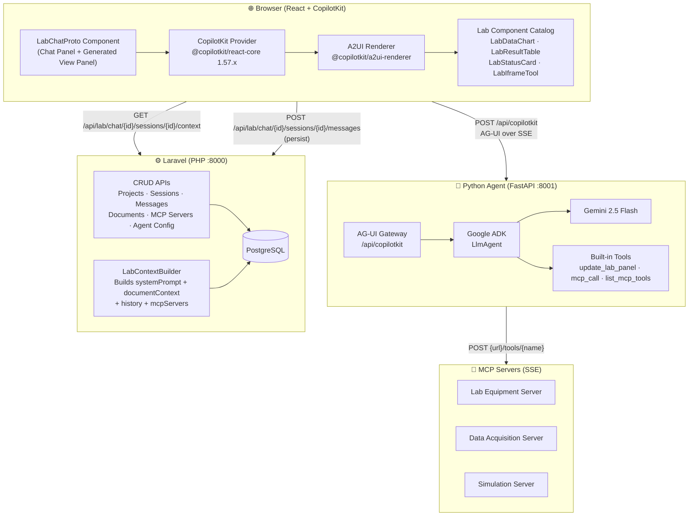
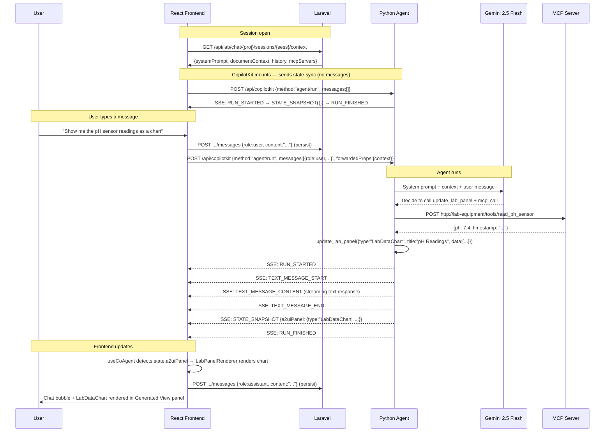
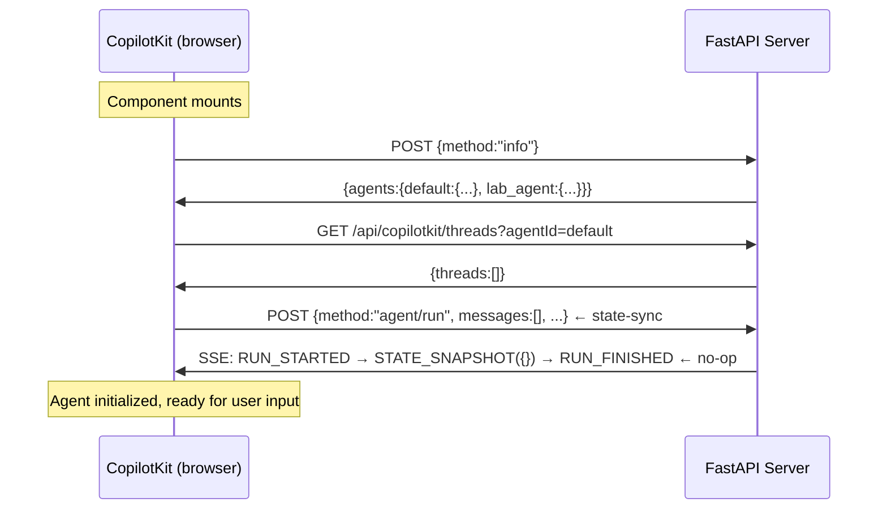
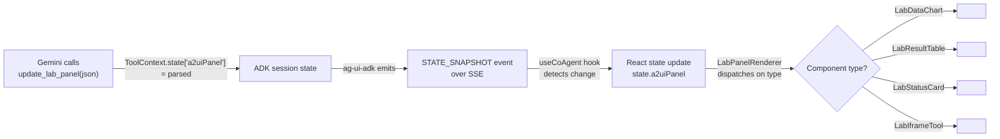
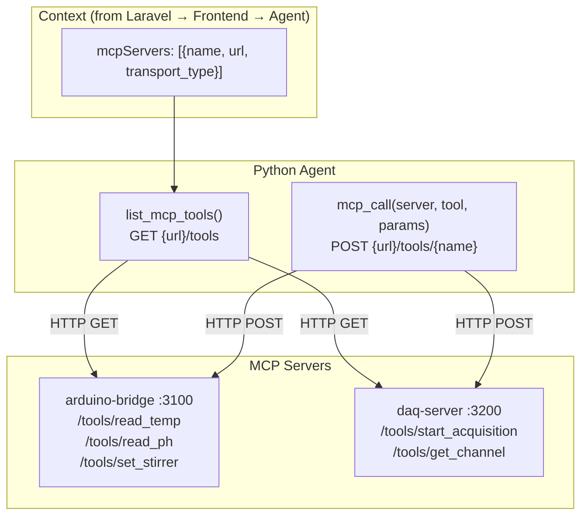

# FabLabOS — Agentic Lab Dashboard: Technical Documentation

> **Version:** POC 1.0 · **Date:** May 2026 · **Status:** Prototype

---

## Table of Contents

1. [System Overview](#1-system-overview)
2. [High-Level Architecture](#2-high-level-architecture)
3. [Technology Stack](#3-technology-stack)
4. [Component Deep-Dives](#4-component-deep-dives)
   - 4.1 [Laravel Backend](#41-laravel-backend)
   - 4.2 [React Frontend](#42-react-frontend)
   - 4.3 [Python ADK Agent](#43-python-adk-agent)
5. [Protocol & Data Flow](#5-protocol--data-flow)
   - 5.1 [AG-UI Single-Transport Protocol](#51-ag-ui-single-transport-protocol)
   - 5.2 [Full Request Lifecycle](#52-full-request-lifecycle)
   - 5.3 [State-Sync Initialization Flow](#53-state-sync-initialization-flow)
6. [Generative UI — A2UI System](#6-generative-ui--a2ui-system)
7. [MCP Tool Integration](#7-mcp-tool-integration)
8. [Deployment Topology](#8-deployment-topology)
9. [Security & Context Isolation](#9-security--context-isolation)
10. [Known Limitations & Roadmap](#10-known-limitations--roadmap)
11. [Video Pitch — Voice-Over Script](#11-video-pitch--voice-over-script)

---

## 1. System Overview

FabLabOS is a multi-tenant STEM laboratory management platform. The **Agentic Lab Dashboard** extends it with an AI-powered workspace where researchers interact with a conversational agent that:

- Understands tenant-specific lab configurations and document libraries
- Executes actions on real lab equipment through **MCP (Model Context Protocol)** servers
- Renders structured, interactive **generative UI panels** — charts, tables, status cards, embedded tools — directly inside the conversation without any front-end code changes per use case

The core insight: **the AI decides what UI to show**, not the developer. A single chat interface becomes infinitely reconfigurable at runtime.

---

## 2. High-Level Architecture



---

## 3. Technology Stack

| Layer | Technology | Role |
|---|---|---|
| **Frontend** | React 18 + TypeScript | SPA shell |
| **Admin Framework** | React Admin (ra-core) | Resource CRUD, routing |
| **AI Chat** | `@copilotkit/react-core` 1.57.x | Chat hooks, agent connection |
| **Generative UI** | `@copilotkit/a2ui-renderer` | BYOC component catalog |
| **Transport** | AG-UI protocol over SSE | Streaming events frontend ↔ agent |
| **AI Agent** | Google ADK (`google-adk`) | Agent orchestration |
| **LLM** | Gemini 2.5 Flash | Language model |
| **Agent Server** | FastAPI + uvicorn | HTTP/SSE server |
| **AG-UI Bridge** | `ag-ui-adk` 0.6.x | ADK ↔ AG-UI protocol adapter |
| **Package Manager** | `uv` | Python dependency management |
| **Backend** | Laravel 11 (PHP 8.3) | API, auth, persistence |
| **Database** | PostgreSQL 17 | Relational storage |
| **Container** | Docker Compose | Local orchestration |

---

## 4. Component Deep-Dives

### 4.1 Laravel Backend

The Laravel backend owns all **persistence and context assembly**. It never talks to the AI agent directly — it pre-builds context and serves it on demand.

```
fablabos/
├── app/
│   ├── Models/Lab/
│   │   ├── LabProject.php             — tenant-scoped lab projects
│   │   ├── LabProjectChatSession.php  — chat session (holds selected doc/mcp IDs)
│   │   ├── LabProjectChatMessage.php  — persisted chat turns
│   │   ├── LabProjectDocument.php     — uploaded documents
│   │   ├── AgentConfiguration.php     — system prompt, instructions per tenant
│   │   └── McpServer.php              — MCP server registry
│   ├── Services/Lab/
│   │   └── LabContextBuilder.php      — assembles context for the agent
│   └── Http/Controllers/API/Lab/
│       └── AgentChat/
│           └── AgentChatController.php
│               ├── getContext()       — GET  .../context
│               └── persistMessage()   — POST .../messages
└── routes/api/lab.php
```

**Context endpoint** (`GET /api/lab/chat/{projectId}/sessions/{sessionId}/context`):

```json
{
  "systemPrompt": "You are the lab assistant for BioTech Lab Alpha...",
  "documentContext": "<document name=\"protocol_v3.pdf\">\n...\n</document>",
  "history": [
    { "role": "user", "content": "What is the current pH level?" },
    { "role": "assistant", "content": "Based on the last reading..." }
  ],
  "mcpServers": [
    {
      "name": "arduino-bridge",
      "transport_type": "sse",
      "url": "http://lab-equipment:3100",
      "config": {}
    }
  ]
}
```

The Python agent **never calls Laravel**. Context travels one-way: Laravel → Frontend → Agent via `properties`.

---

### 4.2 React Frontend

The frontend is built inside `fablab-os-app` using the `dash-auto-admin` resource framework. The lab module adds a custom `showComponent` that replaces the default detail view.

```
fablab-os-app/src/lab/
├── resources/
│   └── labResources.tsx          — registers LabProject with custom showComponent
├── components/
│   ├── LabChatProto.tsx          — minimal prototype: chat + generated view (THIS POC)
│   └── AgenticWindow.tsx         — full version: chat + documents + MCP panel
├── providers/
│   └── LabCopilotProvider.tsx    — fetches context, wraps CopilotKit
└── catalog/
    ├── labCatalog.tsx             — BYOC component definitions (Zod schemas + React components)
    ├── LabPanelRenderer.tsx       — renders agent-emitted panel data
    └── components/
        ├── LabDataChart.tsx       — bar chart via recharts
        ├── LabResultTable.tsx     — data table
        ├── LabStatusCard.tsx      — equipment status card
        └── LabIframeTool.tsx      — embedded iframe tool
```

**Key hooks used:**

```typescript
// Chat stream — uses `useCopilotChatHeadless_c` (full AG-UI API)
// Note: `useCopilotChat` in 1.57.x omits messages/sendMessage (stripped to Open Source tier)
const { messages, sendMessage, isLoading, stopGeneration } = useCopilotChatHeadless_c();

// Agent state subscription — reads a2uiPanel from STATE_SNAPSHOT events
const { state } = useCoAgent<{ a2uiPanel?: unknown }>({ name: 'default' });
const panel = state?.a2uiPanel ?? null;
```

**Two-panel layout:**

```
┌─────────────────────────────────────────────────────────────┐
│                    Lab Project Show View                     │
├───────────────────────────────┬─────────────────────────────┤
│  🤖 Lab Assistant (55%)       │  ✨ Generated View (45%)    │
│                               │                             │
│  [AI message bubbles]         │  [LabDataChart]             │
│  [User message bubbles]       │  [LabResultTable]           │
│  [Typing indicator]           │  [LabStatusCard]            │
│                               │  [LabIframeTool]            │
│  ┌─────────────────────────┐  │                             │
│  │ Ask something…   [Send] │  │   (empty state if no panel) │
│  └─────────────────────────┘  │                             │
└───────────────────────────────┴─────────────────────────────┘
```

---

### 4.3 Python ADK Agent

The agent is a FastAPI application that bridges CopilotKit's AG-UI protocol to Google's ADK runner.

```
gen-ui-poc/agent/
├── Dockerfile
├── pyproject.toml          — dependencies: google-adk, ag-ui-adk, fastapi, uvicorn
├── main.py                 — uvicorn entry point (:8001)
├── server.py               — FastAPI app + AG-UI endpoint routing
└── lab_agent/
    ├── agent.py            — LlmAgent definition + tools
    ├── tools/
    │   └── mcp_proxy.py    — MCP server discovery + invocation
    └── a2ui/
        └── catalog.py      — A2UI component schemas injected into system prompt
```

**Agent definition:**

```python
LlmAgent(
    name="lab_agent",
    model="gemini-2.5-flash",
    instruction=build_instruction,   # dynamic: reads session state for context
    tools=[
        update_lab_panel,            # stores A2UI JSON → STATE_SNAPSHOT → frontend
        mcp_call,                    # proxies to tenant MCP servers
        list_mcp_tools,              # discovers available MCP tools
    ]
)
```

**`update_lab_panel` tool:**

When Gemini decides to show data visually, it calls this tool with a JSON payload matching one of the catalog schemas. The ADK `ToolContext` writes it to session state. The `ag-ui-adk` bridge then emits a `STATE_SNAPSHOT` event carrying this state. CopilotKit's `useCoAgent` hook picks it up and re-renders the panel.

```python
def update_lab_panel(panel_data: str, tool_context: ToolContext = None) -> str:
    parsed = json.loads(panel_data)
    if tool_context and hasattr(tool_context, "state"):
        tool_context.state["a2uiPanel"] = parsed
    return "Panel updated"
```

---

## 5. Protocol & Data Flow

### 5.1 AG-UI Single-Transport Protocol

CopilotKit 1.57.x uses a **single HTTP endpoint** for all communication. Every request is a `POST /api/copilotkit` with a JSON envelope:

```
Client → Server                           Server → Client
──────────────────────────────────────    ──────────────────────────────────────
{"method": "info"}                   →    {"mode":"sse","agents":{...},"a2uiEnabled":true}

{"method": "agent/run",             →     data: {"type":"RUN_STARTED",...}
 "params": {"agentId": "default"},         data: {"type":"TEXT_MESSAGE_START",...}
 "body": {                                 data: {"type":"TEXT_MESSAGE_CONTENT",...}
   "threadId": "uuid",                     data: {"type":"TEXT_MESSAGE_END",...}
   "runId": "uuid",                        data: {"type":"STATE_SNAPSHOT","snapshot":{...}}
   "messages": [...],                      data: {"type":"RUN_FINISHED",...}
   "forwardedProps": {...},
   "state": {...}
 }
}

GET /api/copilotkit/threads          →    {"threads": []}
```

The server routes requests based on the `method` field and the presence of user messages:

```mermaid
flowchart TD
    A[POST /api/copilotkit] --> B{body.method}
    B -->|"info"| C[Return agent registry JSON]
    B -->|"agent/run" or "agent/connect"| D[Extract body.body as RunAgentInput]
    D --> E{Has user message?}
    E -->|No| F[Return no-op stream\nRUN_STARTED → STATE_SNAPSHOT → RUN_FINISHED]
    E -->|Yes| G[Inject context from forwarded_props into session state]
    G --> H{Accept: text/event-stream?}
    H -->|Yes| I[EventSourceResponse + _sse_stream]
    H -->|No| J[StreamingResponse + _legacy_stream]
```

---

### 5.2 Full Request Lifecycle



---

### 5.3 State-Sync Initialization Flow

CopilotKit's `useCoAgent` hook triggers a "state-sync" run on mount to hydrate the agent's state. Since the ADK runner requires a user message, the server intercepts these empty-message runs and returns a fast no-op stream:



---

## 6. Generative UI — A2UI System

The A2UI system allows the AI agent to **choose which UI components to render** at runtime. No front-end deployments are needed to add new visualization types to the prompt.

### Component Catalog

Four components are registered in the `labCatalog`:

| Component | Schema | Purpose |
|---|---|---|
| `LabDataChart` | `{title, unit?, data:[{label, value}]}` | Bar chart for sensor readings / experiment results |
| `LabResultTable` | `{title?, columns:[], rows:[[]]}` | Multi-column comparison tables |
| `LabStatusCard` | `{title, status:"active"\|"warning"\|"error"\|"idle", metrics?:[{label,value}]}` | Equipment or experiment health |
| `LabIframeTool` | `{url, title?, height?}` | Embedded simulation or instrument UI |

### Schema → System Prompt Injection

```python
# lab_agent/a2ui/catalog.py
A2UI_SYSTEM_PROMPT = """
When presenting data visually, call update_lab_panel with JSON matching one schema:

LabDataChart: {"type":"LabDataChart","title":"..","unit":"..","data":[{"label":"..","value":0}]}
LabResultTable: {"type":"LabResultTable","title":"..","columns":["A","B"],"rows":[["x",1]]}
LabStatusCard: {"type":"LabStatusCard","title":"..","status":"active","metrics":[{"label":"pH","value":"7.4"}]}
LabIframeTool: {"type":"LabIframeTool","url":"https://..","title":"..","height":400}

You may pass an array to render multiple panels simultaneously.
"""
```

### Rendering Flow



---

## 7. MCP Tool Integration

MCP (Model Context Protocol) servers expose lab equipment and data services over HTTP/SSE. The agent discovers and calls them dynamically using context passed from the frontend.



The agent's `list_mcp_tools` returns available tools from all configured MCP servers. Gemini then decides which tools to call based on the user's request. Results flow back through the ADK runner into the agent's reasoning context.

---

## 8. Deployment Topology

### Local Development

```
┌─ Host Machine ───────────────────────────────────────────────┐
│                                                              │
│  Vite Dev Server :3010   ←── React + HMR                   │
│  Laravel Sail    :8000   ←── PHP API + PostgreSQL           │
│                                                              │
│  ┌─ Docker Compose (gen-ui-poc) ──────────────────────────┐  │
│  │                                                        │  │
│  │  gen-ui-poc-agent-1   :8001  ←── FastAPI + ADK        │  │
│  │                                                        │  │
│  └────────────────────────────────────────────────────────┘  │
│                                                              │
│  .env (fablab-os-app):                                       │
│    VITE_LAB_AGENT_URL=http://localhost:8001                  │
│    VITE_LAB_COPILOT_LICENCE=ck_pub_...                       │
└──────────────────────────────────────────────────────────────┘
```

### Target Production

```
┌─ CDN / Edge ────────────────────┐
│  Static React SPA               │
└─────────────┬───────────────────┘
              │ API calls
┌─────────────▼───────────────────┐    ┌─ AI Cluster ─────────────┐
│  Laravel API (PHP-FPM)          │    │                          │
│  Nginx → Laravel :80            │    │  Python Agent            │
│  PostgreSQL + Redis             │    │  (FastAPI, uvicorn)      │
│                                 │    │  GPU/TPU optional        │
└─────────────────────────────────┘    └──────────────────────────┘
```

### Environment Variables

| Variable | Location | Purpose |
|---|---|---|
| `VITE_LAB_AGENT_URL` | `.env` (frontend) | FastAPI agent base URL |
| `VITE_LAB_COPILOT_LICENCE` | `.env` (frontend) | CopilotKit public API key |
| `GOOGLE_API_KEY` | `agent/.env` | Gemini API key |

---

## 9. Security & Context Isolation

| Concern | Mechanism |
|---|---|
| **Tenant isolation** | Laravel API enforces tenant_id on all queries; context endpoint checks project ownership |
| **Auth token** | Bearer token passed in `Authorization` header to both Laravel and forwarded to agent |
| **Agent ↔ Laravel** | Zero direct calls — agent never has DB access; all data pre-packaged by Laravel |
| **MCP servers** | Only URLs stored in tenant's McpServer records are callable; agent cannot discover arbitrary endpoints |
| **CORS** | Agent allows `*` in dev; should be scoped to frontend origin in production |
| **Google API Key** | Server-side only, never exposed to browser |

---

## 10. Known Limitations & Roadmap

### POC Limitations

| Area | Limitation | Planned Fix |
|---|---|---|
| **Session persistence** | Messages shown from CopilotKit in-memory state only; history loaded at session open | Reload history into `initialMessages` |
| **Agent state scope** | A2UI panel resets on page reload | Persist `a2uiPanel` to session DB |
| **MCP auth** | No per-server authentication | Add API key / OAuth per McpServer |
| **Document types** | Only text/markdown/CSV inlined; PDFs referenced by name only | Integrate Gemini Files API for binary |
| **Multi-turn context window** | Long conversations may exceed model limits | Implement sliding window summarization |
| **Streaming reliability** | No reconnect logic on SSE drop | Add exponential backoff in CopilotKit config |

### Roadmap

```
Phase 1 (POC) ─── NOW ──────────────────────────────────────────► Done
  ✅ Streaming chat with Gemini 2.5 Flash
  ✅ Generative UI panels (A2UI + BYOC catalog)
  ✅ MCP tool proxy
  ✅ AG-UI protocol integration

Phase 2 (MVP) ──────────────────────────────────────────────────► Q3 2026
  □ Full session history reload
  □ Document ingestion (PDF, DOCX) via Files API
  □ Multi-agent routing (specialized agents per domain)
  □ Real-time sensor data streaming panels

Phase 3 (Production) ───────────────────────────────────────────► Q4 2026
  □ Fine-tuned domain model
  □ Offline/edge deployment option
  □ Audit trail & compliance logging
  □ Mobile-responsive layout
```

---

## 11. Video Pitch — Voice-Over Script

---

*[Open on a clean dark dashboard. A researcher sits at their workstation.]*

---

**"Every STEM laboratory runs on data. Sensor readings, experiment protocols, equipment states, team notes — scattered across spreadsheets, PDFs, and proprietary software. Researchers spend more time managing information than doing science."**

*[Cut to the FabLabOS dashboard. User clicks into a lab project.]*

---

**"FabLabOS changes that. This is the Agentic Lab Dashboard — an AI-powered workspace built directly into your laboratory management platform."**

*[The two-panel interface appears: chat on the left, a glowing 'Generated View' panel on the right.]*

---

**"There are no forms to fill. No separate analytics tool to open. You just ask."**

*[User types: "What's the current pH level in reactor 2 and how does it compare to last week?"]*

---

**"The assistant connects to your live lab equipment through the Model Context Protocol — a standardized bridge to any instrument that can speak HTTP."**

*[The right panel animates: a bar chart appears showing pH readings over time. The assistant's response streams in.]*

---

**"And here's what makes this different: the AI decides what to show. Not a developer. Not a template. The model reads the data, picks the right visualization, and renders it — in real time, inside your conversation."**

*[Panel switches from chart to a status card showing equipment health: green 'active' indicators across five sensors.]*

---

**"Ask it to check your equipment status — you get a live status card. Ask it to compare experiment results — you get a comparison table. Ask it to open the simulation interface — an embedded tool appears, right here, without leaving the dashboard."**

*[User types: "Run a quick simulation with these parameters." An iframe opens inside the panel.]*

---

**"The assistant knows your lab. It reads your protocols, your uploaded documents, your tenant configuration. Every answer is grounded in your actual data — not generic AI output."**

*[Cut to the system architecture diagram, animated.]*

---

**"Under the hood, we use Google's Gemini 2.5 Flash for reasoning, Google ADK for agent orchestration, and the AG-UI open protocol for streaming communication between the browser and the agent. The frontend is built with CopilotKit's A2UI renderer — a catalog of custom components that the model can invoke declaratively."**

*[Zoom out to show the full stack: Laravel, React, FastAPI, Gemini.]*

---

**"Everything runs on your infrastructure. Your data never leaves your environment. The AI agent never accesses the database directly — all context is assembled by your backend and passed securely at runtime."**

*[Back to the researcher at the dashboard. They lean back, satisfied.]*

---

**"This is what we're building at FabLabOS: a laboratory platform where the interface adapts to the science — not the other way around. Where every researcher has an intelligent assistant that understands their domain, their instruments, and their data."**

*[Logo animation. Tagline fades in.]*

---

**"FabLabOS. The intelligent laboratory."**

*[Contact / URL / Call to action]*

---

---

*End of Document*

---

## 12. Implementation Caveats & Non-Obvious Decisions

This section documents the hard-won discoveries made during development — behaviours that are not in the official docs and cost significant debugging time. Future implementors: read this first.

---

### 12.1  Both `default` and `lab_agent` Must Appear in the Info Response

**What happens if you omit `default`:** The React app crashes on mount with:
```
useAgent: Agent 'default' not found after runtime sync
```

**Why:** `useCopilotChatHeadless_c()` (and the underlying CopilotKit 1.57.x chat machinery) internally subscribes to an agent named `"default"` regardless of which named agent you configure. It does not use the agent name passed to `useCoAgent` for its own subscription — it always uses the literal string `"default"`. If the info response does not include a `default` entry in the `agents` map, the runtime sync fails and the entire React tree errors out.

**Fix:** Always declare both agents, even if `lab_agent` is your actual agent:

```python
return JSONResponse({
    "mode": "sse",
    "a2uiEnabled": True,
    "agents": {
        "default":   {"description": "FabLab STEM laboratory assistant"},
        "lab_agent": {"description": "FabLab STEM laboratory assistant"},
    },
})
```

---

### 12.2  State-Sync Runs Must Be Intercepted Before Reaching the ADK Runner

**What happens if you don't:** Google ADK raises:
```
Running an agent requires either a new_message or an invocation_id
```
and the SSE stream terminates with a `RUN_ERROR` event. CopilotKit then emits `agent_connect_failed` and the agent is marked as offline.

**Why:** On every component mount, CopilotKit's `useCoAgent` hook fires a "state-sync" run — an `agent/run` request with an empty `messages` array — to hydrate the agent's state from the server. This is by design in CopilotKit's A2UI pattern. Google ADK's runner, however, does not accept a run with no messages and no `invocation_id`. The two frameworks are incompatible at this boundary.

**Fix:** Before passing the request to the ADK runner, check for the presence of a user message and return a fast no-op stream if none is found:

```python
messages = run_body.get("messages", []) if isinstance(run_body, dict) else []
has_user_message = any(
    isinstance(m, dict) and m.get("role") == "user" for m in messages
)
if not has_user_message:
    # Short-circuit: return a valid AG-UI lifecycle without invoking ADK
    return EventSourceResponse(_noop_sse_stream(thread_id, run_id))
```

The no-op stream must still emit a complete AG-UI lifecycle (`RUN_STARTED → STATE_SNAPSHOT → RUN_FINISHED`) or CopilotKit will consider the run incomplete.

---

### 12.3  No-Op SSE Events Must Use `ServerSentEvent` Objects, Not Plain Strings

**What happens if you yield plain strings:** The browser receives a malformed SSE stream and logs:
```
Unexpected non-whitespace character after JSON at position 126
```
The `data:` prefix is doubled or the frame boundaries are wrong, making the JSON unparseable.

**Why:** `EventSourceResponse` (from `sse-starlette`) expects either `ServerSentEvent` objects or specific dict shapes — it wraps plain strings in an additional `data:` prefix, resulting in `data: data: {...}` in the wire format.

The `ag_ui_adk` bridge uses a private `_sse_event` helper that constructs `ServerSentEvent(data=..., sep="\n")`. The no-op stream must be byte-identical to what the bridge produces, or the client's SSE parser fails on the first event boundary.

**Fix:** Always yield `ServerSentEvent` objects in the no-op generator:

```python
def _sse(data: str) -> ServerSentEvent:
    return ServerSentEvent(data=data, sep="\n")   # sep="\n" is critical

async def _noop_sse_stream(thread_id: str, run_id: str):
    yield _sse(json.dumps({"type": "RUN_STARTED",     "threadId": thread_id, "runId": run_id}))
    yield _sse(json.dumps({"type": "STATE_SNAPSHOT",  "snapshot": {}}))
    yield _sse(json.dumps({"type": "RUN_FINISHED",    "threadId": thread_id, "runId": run_id}))
```

---

### 12.4  Accept-Header Routing Applies to the No-Op Path Too

**What happens if you don't check:** Non-SSE clients (CopilotKit fallback mode, some proxies) receive a `text/event-stream` response when they expected NDJSON, causing a parse error on the client.

**Why:** CopilotKit sends requests with either `Accept: text/event-stream` (SSE mode) or a generic accept header (NDJSON/legacy mode). The `ag_ui_adk` bridge already handles this for the real ADK path via `EventEncoder`. The no-op path needs the same check.

**Fix:** Mirror the Accept-header branch in the no-op path:

```python
encoder      = EventEncoder(accept=request.headers.get("accept", ""))
content_type = encoder.get_content_type()

if not has_user_message:
    if content_type == "text/event-stream":
        return EventSourceResponse(_noop_sse_stream(thread_id, run_id))
    return StreamingResponse(_noop_legacy_stream(thread_id, run_id), media_type=content_type)
```

---

### 12.5  CopilotKit 1.57.x Strips `messages` and `sendMessage` from `useCopilotChat`

**What happens if you use `useCopilotChat`:** TypeScript compilation fails with:
```
Property 'messages' does not exist on type 'Omit<UseCopilotChatReturn, "messages" | "sendMessage" | ...>'
```

**Why:** In CopilotKit 1.57.1, `useCopilotChat()` returns a type that explicitly omits `messages`, `sendMessage`, `isLoading`, and `stopGeneration`. These are only available on the internal `useCopilotChatHeadless_c` export — the `_c` suffix indicates a "cloud" or "commercial" tier API. The open-source export has these members stripped.

**Fix:** Import and use the headless variant directly:

```typescript
import { useCopilotChatHeadless_c } from '@copilotkit/react-core';

const { messages, sendMessage, isLoading, stopGeneration } = useCopilotChatHeadless_c();
```

Note: the `_c` suffix is intentional and not a typo — it is the stable export name at this version.

---

### 12.6  The CopilotKit Single-Transport Envelope Must Be Unwrapped

**What happens if you don't:** The server receives the outer `{"method":"agent/run","body":{...}}` envelope and tries to parse it as `RunAgentInput`, which fails because the top-level object has no `threadId`, `runId`, or `messages` fields.

**Why:** CopilotKit 1.57.x uses a single-transport protocol where all requests go to the same URL (`POST /api/copilotkit`) with a method envelope. The actual `RunAgentInput` payload is nested under `body`:

```json
{
  "method": "agent/run",
  "params": { "agentId": "default" },
  "body": {
    "threadId": "...",
    "runId": "...",
    "messages": [...],
    "forwardedProps": {...}
  }
}
```

**Fix:** Extract `body["body"]` when the method is `agent/run` or `agent/connect`:

```python
method = body.get("method", "") if isinstance(body, dict) else ""
if method in ("agent/run", "agent/connect"):
    run_body = body.get("body", {})
else:
    run_body = body  # direct RunAgentInput (legacy clients)
```

---

### 12.7  ADK `ToolContext` Injection Requires a Type Annotation

**What happens if you omit it:** The `update_lab_panel` tool receives `tool_context=None` at runtime — ADK does not inject the context, so `tool_context.state["a2uiPanel"]` is never written, and the frontend panel never updates.

**Why:** Google ADK inspects the tool function's type annotations to decide which framework objects to inject. A parameter named `tool_context` without a `ToolContext` type annotation is treated as a regular user-supplied argument, not an injected one.

**Fix:** Always annotate with `= None` default and the full type:

```python
from google.adk.tools import ToolContext

def update_lab_panel(panel_data: str, tool_context: ToolContext = None) -> str:
    ...
    if tool_context and hasattr(tool_context, "state"):
        tool_context.state["a2uiPanel"] = parsed
```

---

### 12.8  `gemini-2.0-flash` Is Unavailable for New API Keys

**What happens:** The ADK runner raises a 404 or quota error immediately on the first request.

**Why:** `gemini-2.0-flash` was deprecated for new API key holders. Existing keys may still have access; new keys do not. The model string must be updated.

**Fix:** Use `gemini-2.5-flash` (current as of May 2026):

```python
LlmAgent(
    name="lab_agent",
    model="gemini-2.5-flash",
    ...
)
```

---

### 12.9  The `a2ui` Python SDK Does Not Exist on PyPI

**What happens if you try to install it:** `uv add a2ui` fails — no package found.

**Why:** At the time of this POC, Google's A2UI Python SDK (`a2ui`) is not published to PyPI. It exists only as a JavaScript/TypeScript package (`@copilotkit/a2ui-renderer`) on the frontend side. The Python-side "catalog" concept has no installable counterpart.

**Fix:** Inject component schemas directly into the agent's system prompt as structured text. The agent learns what JSON shape to emit for each component type; the frontend's BYOC catalog handles the actual rendering. No Python SDK is needed:

```python
# lab_agent/a2ui/catalog.py
A2UI_SYSTEM_PROMPT = """
When presenting data visually, call update_lab_panel with JSON matching one schema:
LabDataChart: {"type":"LabDataChart","title":"..","data":[{"label":"..","value":0}]}
...
"""
```

---

### 12.10  `forwarded_props` vs `state` in Session Context

**What happens if you read from the wrong key:** Context fields (`systemPrompt`, `documentContext`, `mcpServers`) are always empty strings / empty lists, so the agent has no tenant configuration and produces generic responses.

**Why:** CopilotKit passes the `properties` object from `<CopilotKit properties={context}>` into the request as `forwardedProps` (not `state`). The two are merged in `server.py` — `forwarded_props` is extracted and written into `input_data.state` so that the ADK `build_instruction` function and MCP tools can read them from `tool_context.state`. If you skip this merge step, the values never reach the agent.

**Fix:** Explicitly copy `forwarded_props` into session state before invoking the ADK runner:

```python
extracted = await _extract_lab_context(request, input_data)
if extracted:
    existing_state = input_data.state if isinstance(input_data.state, dict) else {}
    input_data = input_data.model_copy(update={"state": {**existing_state, **extracted}})
```

---
